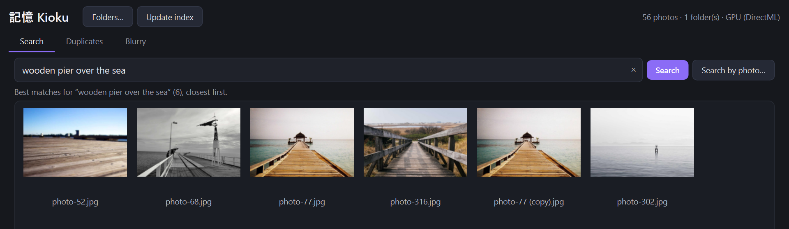
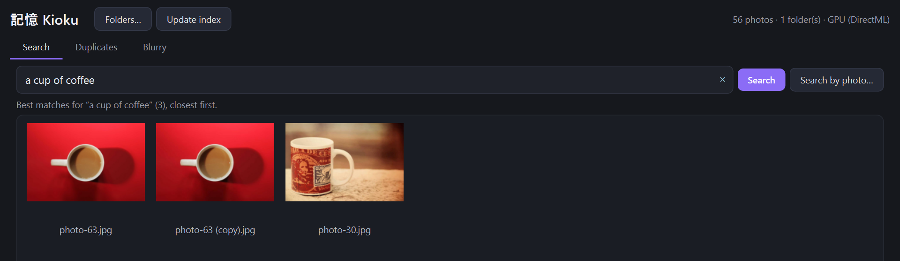
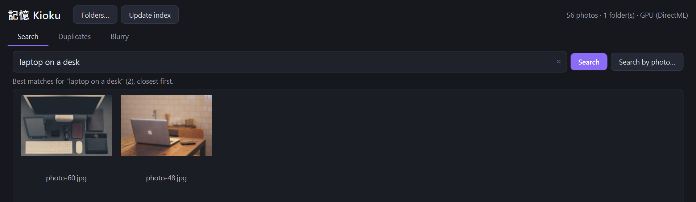
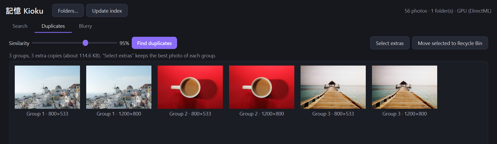
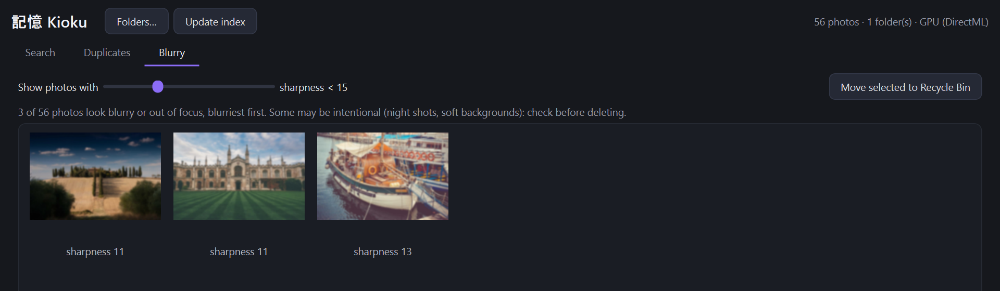

# Kioku (記憶)

**Search your photo folders by describing them — offline, on Windows.**

Type *"beach at sunset"*, *"birthday cake"* or *"screenshot of code"* and Kioku finds the matching
photos in your own folders. It also finds near-duplicate photos and blurry shots so you can clean
up. Nothing is uploaded: the AI model runs on your PC, on the GPU if you have one, on the CPU if not.

**[⬇ Download the Windows installer](https://github.com/ItsAloka/Kioku/releases/latest)**
(266 MB, Windows 10/11 64-bit, no admin rights needed)



| "a cup of coffee" | "laptop on a desk" |
|---|---|
|  |  |

| Duplicates | Blurry |
|---|---|
|  |  |

<sub>Demo photos from Unsplash — credits in [docs/DEMO_PHOTOS.md](docs/DEMO_PHOTOS.md).</sub>

## Features

- **Search by description** — natural-language search over every indexed photo
- **Search by photo** — pick any image (or right-click → *Find similar*) to find photos that look like it
- **Duplicates** — groups near-identical photos (resized, re-saved, burst shots) and pre-selects the extra copies
- **Blurry** — lists out-of-focus and shaken photos, blurriest first
- **Safe** — photos are never modified; delete always asks first and goes to the Recycle Bin
- **Incremental** — only new or changed photos are re-indexed; unplugged drives are kept

## How it works

1. **Indexing.** Each photo is decoded (at most 512 px) on a thread pool and turned into a vector of
   512 numbers by the image half of **CLIP ViT-B/16**. Vectors go into a local SQLite database.
2. **Search.** Your text goes through CLIP's text half into the *same* vector space, so "a dog on a
   beach" lands near photos of dogs on beaches. Ranking is one matrix multiplication — a few
   milliseconds even for tens of thousands of photos. Results must pass an absolute score floor
   *and* stay close to the best hit, so a search returns the photos that really match, not the
   whole library.
3. **Duplicates.** Pairs with very similar CLIP vectors *and* matching 8×8 colour miniatures (CLIP
   alone calls two different beach photos "the same"), merged into groups with union-find.
4. **Blur.** The mean of the strongest 0.3 % Laplacian responses: *is anything in this photo in
   focus?* The usual variance-of-Laplacian wrongly flags sharp photos with few edges (clear sky,
   screenshots).

### Why ONNX Runtime + DirectML instead of PyTorch

- **Size:** PyTorch with CUDA is 2+ GB. ONNX Runtime is ~20 MB.
- **Any GPU:** DirectML runs on any DirectX 12 GPU — NVIDIA, AMD *and* Intel integrated graphics —
  not only NVIDIA/CUDA. With no usable GPU it falls back to the CPU automatically.
- **Text model int8** (4× smaller, runs on the CPU in milliseconds); image model fp32 for accuracy.

## Performance

Measured on the development laptop (20-core CPU, DirectML GPU), 280 real family photos:

| | CLIP ViT-B/16 (default) | SigLIP 2 B/16 (optional) |
|---|---|---|
| Indexing, GPU | 148 photos/s | 129 photos/s |
| Indexing, CPU only | 20 photos/s | 10 photos/s |
| One text search | 16 ms (GPU PC) / 56 ms (CPU) | 47 ms / 142 ms |
| Model files | ~410 MB | ~690 MB |
| ImageNet zero-shot accuracy* | ~68 % | ~78 % |

\*Published benchmark figures for each model, not measured here.

## Models

The default is **CLIP ViT-B/16** (OpenAI, MIT) because it keeps the installer small and runs well
on old laptops. **SigLIP 2** (Google, Apache-2.0) is already supported and is noticeably more
accurate and multilingual:

```bash
python packaging/fetch_model.py siglip2-b16-224
set KIOKU_MODEL=siglip2-b16-224
```

Switching model re-indexes the photos once (vectors from different models can't be compared).

## Roadmap

Ideas for future versions, with how each would be built and what it adds to the install.
Install-size figures are estimates.

| # | Feature | How | Model | Adds |
|---|---|---|---|---|
| 1 | **Best-shot picker** — in each duplicate/burst group, choose the best photo and offer to remove the rest | Score each photo by sharpness (existing blur score), exposure (histogram clipping) and resolution | none | 0 MB |
| 2 | **Cleanup report** — "free 2.3 GB: 140 duplicates, 85 blurry, 300 screenshots" in one screen | Combine duplicate groups, blur scores and a CLIP "screenshot" query; totals from file sizes | none | 0 MB |
| 3 | **Privacy scanner** — find photos of ID cards, passports, bank cards, password screenshots | Zero-shot CLIP prompts ("a photo of a passport", "a credit card", …) with tuned thresholds; confirm with OCR (#4) | CLIP (existing) | 0 MB |
| 4 | **Text-in-photo search (OCR)** — find screenshots and receipts by the words in them | Windows' built-in OCR (`Windows.Media.Ocr`), or PaddleOCR mobile models via RapidOCR on ONNX Runtime; store text in SQLite FTS5 | Windows OCR / PP-OCR mobile | 0 MB / ~15 MB |
| 5 | **Sinhala / Tamil search** | Multilingual text encoder in the same space as the images | SigLIP 2 (multilingual tokenizer) | ~+280 MB |
| 6 | **Auto-albums / events** | Cluster by EXIF date (time gaps) and GPS, refine with CLIP similarity; name events from top CLIP labels | CLIP (existing) | 0 MB |
| 7 | **Face grouping** — "all photos of this person" | Detect faces with YuNet, embed with SFace (OpenCV Zoo, MIT/Apache), cluster; kept local and opt-in | YuNet + SFace | ~40 MB |
| 8 | **Model choice at install** — "Fast/small" vs "Accurate" | Ship CLIP by default; download SigLIP 2 on demand from the settings | SigLIP 2 | 0 MB (optional download) |

## Install

Download `Kioku-Setup-1.0.0.exe` from [Releases](https://github.com/ItsAloka/Kioku/releases/latest)
and run it. The installer is not code-signed, so Windows SmartScreen may warn: click
**More info → Run anyway**. Add a photo folder, wait for the first index, then type what you're
looking for.

## Build from source

```bash
py -3.11 -m venv .venv
.venv/Scripts/pip install -e ".[dev]"
.venv/Scripts/python packaging/fetch_model.py          # model files, SHA-256 checked
PYTHONPATH=src .venv/Scripts/python -m kioku           # run
.venv/Scripts/python -m pytest -q                      # tests
.venv/Scripts/python packaging/build.py                # PyInstaller + Inno Setup installer
```

## Licence

MIT — see `LICENSE`. Third-party components and model licences: `THIRD_PARTY_NOTICES.md`.
